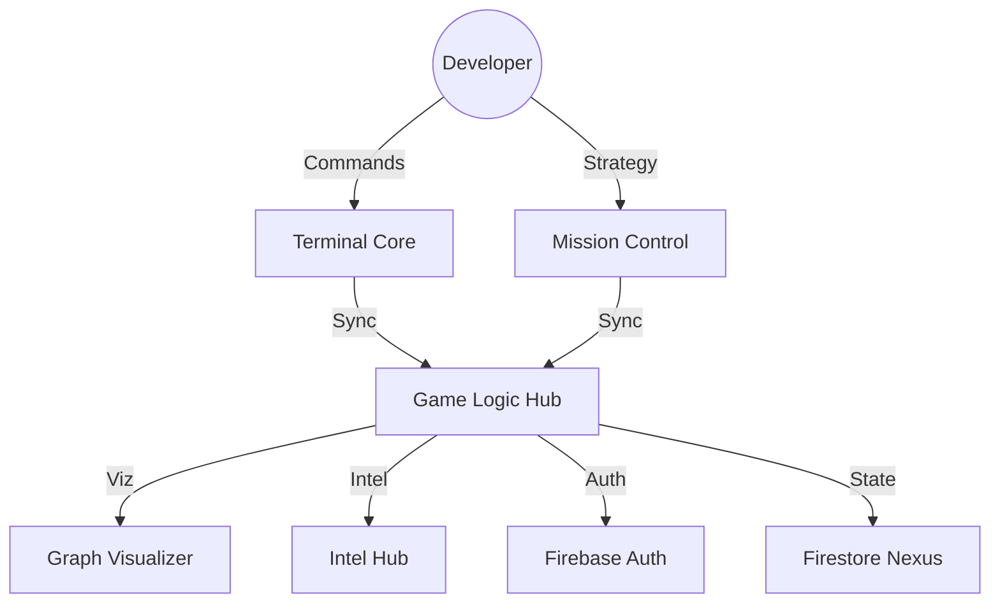

<div align="center">


# 🌌 GITVEDA

**The Ultimate Neural Learning Platform for Next-Gen Architects.**
*Level Up your Git Intelligence with 3D Visualizations and Mission-Driven Interaction.*

[](#)
[](#)
[](#)

---

### [ 🛸 LAUNCH 3D ARCHITECTURE SHOWCASE ](./SHOWCASE.html)

---

</div>

## 🧬 Neural Core Dimensions

| Dimension | Neural Capability | Level |
| :--- | :--- | :--- |
| **🕹️ TERMINAL** | Master 30+ Git protocols via high-fidelity console simulation. | **PLATINUM** |
| **🧊 VISUALS** | Dynamic 3D repository mapping & real-time commit graphing. | **ELITE** |
| **🛰️ MISSIONS** | Split-screen workflow integration for zero-latency execution. | **SUPREME** |
| **🧠 INTEL** | Command-specific intelligence modules [3 Easy Steps]. | **KNOWLEDGE+** |

---

## 🏛️ System Architecture



---

## 🛠️ Technical Matrix

<div align="center">

| Layer | Neural Tech Stack |
| :--- | :--- |
| **Interface** | `React 18` | `Vite` | `Neural SCSS` |
| **State** | `Context API` | `useReducer` |
| **Persistence** | `Firebase Auth` | `Firestore` |
| **Visualization** | `Three.js` | `SVG/Canvas` |

</div>

---

## 🚀 Accessing the Nexus

### 1. Initialize Neural Interface
```bash
git clone https://github.com/kartikeya2006jay/GitVeda.git
cd GitVeda
```

### 2. Configure Subsystems
```bash
cp .env.example .env
# Edit .env with your Neural Synchronization Keys
```

### 3. Deploy Local Node
```bash
npm install
npm run dev
```

---

<div align="center">
  <p><sub>Built with 💙 by <b>Kartikeya Yadav</b> for the next generation of architects.</sub></p>
</div>
