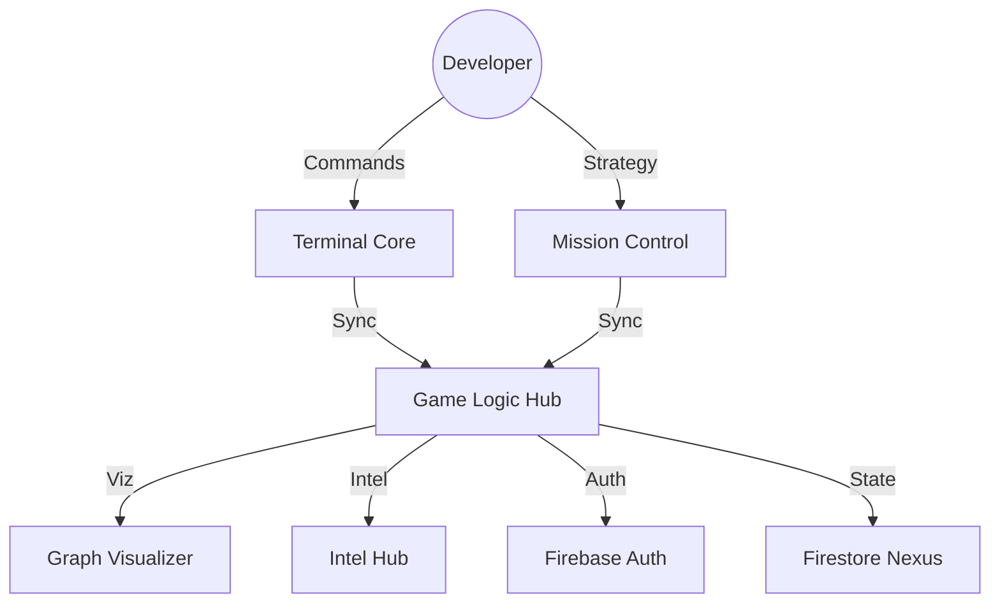

<div align="center">


# 🌌 GITVEDA

**The Ultimate Neural Learning Platform for Next-Gen Architects.**
*Level Up your Git Intelligence with 3D Visualizations and Mission-Driven Interaction.*

[](#)
[](#)
[](#)

---

### [ 🛸 LAUNCH 3D ARCHITECTURE SHOWCASE ](./SHOWCASE.html)

---

</div>

## 🧬 Neural Core Dimensions

| Dimension | Neural Capability | Level |
| :--- | :--- | :--- |
| **🕹️ TERMINAL** | Master 30+ Git protocols via high-fidelity console simulation. | **PLATINUM** |
| **🧊 VISUALS** | Dynamic 3D repository mapping & real-time commit graphing. | **ELITE** |
| **🛰️ MISSIONS** | Split-screen workflow integration for zero-latency execution. | **SUPREME** |
| **🧠 INTEL** | Command-specific intelligence modules [3 Easy Steps]. | **KNOWLEDGE+** |

---

## 🏛️ System Architecture



---

## 🛠️ Tech Matrix

- **CORE**: `React 18` | `Vite` | `Neural SCSS`
- **STATE**: `Context API` | `useReducer`
- **NEXUS**: `Firebase Auth` | `Firestore`
- **RENDER**: `Three.js` (Showcase) | `SVG/Canvas` (Visualizer)

---

## 🚀 Accessing the Nexus

### 1. Initialize Neural Interface
Clone the repository and enter the local core.

```bash
git clone https://github.com/kartikeya2006jay/GitVeda.git
cd GitVeda
```

### 2. Configure Subsystems
Duplicate the environment template and inject your Firebase credentials.

```bash
cp .env.example .env
# Edit .env with your Neural Synchronization Keys
```

### 3. Deploy Local Node
Initialize dependencies and launch the dev environment.

```bash
npm install
npm run dev
```

---

<div align="center">
  <p><sub>Built with 💙 by <b>Antigravity</b> for the next generation of architects.</sub></p>
  <p><b>Neural Core v1.0.4</b></p>
</div>
