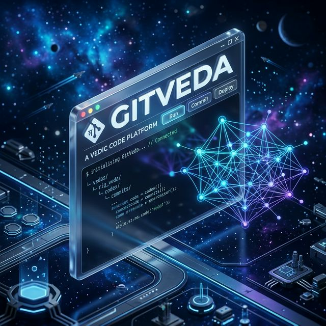
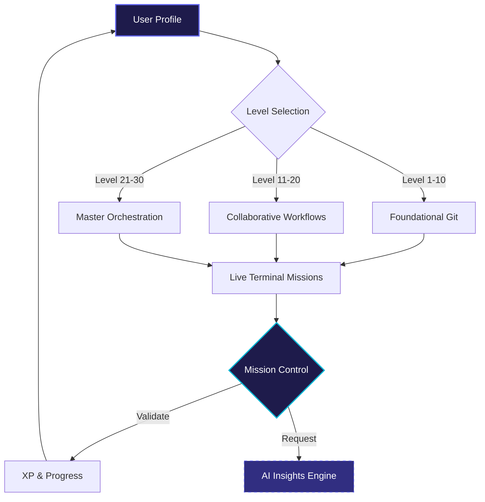

<div align="center">
  

  # 🌌 GitVeda
  ### The Neural Path to Git Mastery

  [](https://reactjs.org/)
  [](https://vitejs.dev/)
  [](https://firebase.google.com/)
  [](LICENSE)
  [](CONTRIBUTING.md)

  **GitVeda** is a high-fidelity, gamified learning platform that transforms the complex landscape of Git versions and workflows into an immersive, mission-driven experience.
</div>

---

## 🛰️ Neural Core Architecture

Visualize the flow of knowledge from basic initialization to advanced multi-branch orchestration.



---

## 🔥 Key Features

<table width="100%">
  <tr>
    <td width="50%" valign="top">
      <h4>🕹️ Gamified Missions</h4>
      <p>Master 30 levels of increasing complexity, from <code>git init</code> to <code>bisect</code> and interactive rebasing.</p>
    </td>
    <td width="50%" valign="top">
      <h4>💻 Live Terminal</h4>
      <p>Execute real Git commands in a persistent, reactive terminal environment with instant verification.</p>
    </td>
  </tr>
  <tr>
    <td width="50%" valign="top">
      <h4>🧠 Neural AI Insights</h4>
      <p>Stuck on a mission? Our AI Hint Engine analyzes your current state and provides contextual, cryptic guidance.</p>
    </td>
    <td width="50%" valign="top">
      <h4>📊 Mission Control</h4>
      <p>Track your streaks, XP, and mission objectives through a premium, glassmorphic dashboard interface.</p>
    </td>
  </tr>
</table>

---

## 🏆 Level Campaign

| Phase | Milestone | Mastery Scope |
| :--- | :--- | :--- |
| **I** | 🌱 **The Sprouting** | Local repo setup, staging, and atomic commits. |
| **II** | 🌿 **The Branching** | Conflict resolution, remote sync, and stashing. |
| **III** | 🌳 **The Orchestration** | Reflogs, interactive rebasing, and surgical cherry-picking. |

---

## ✨ Neural Showcase

Experience the project in its full 3D glory. Our interactive showcase highlights the underlying neural architecture that powers the GitVeda platform.

> [!TIP]
> Check out the [Interactive 3D Showcase](SHOWCASE.html) to see the Neural Core in action!

---

## 🚀 Quick Start

### 1. Initialize
```bash
git clone https://github.com/kartikeya2006jay/GitVeda.git
cd GitVeda
```

### 2. Prepare Environment
```bash
npm install
cp .env.example .env
```
*Fill in your Firebase credentials in the `.env` file.*

### 3. Launch Core
```bash
npm run dev
```

---

## 🛠️ Tech Stack

- **Architect**: React 18 & Vite
- **Styling**: Premium SCSS with Glassmorphic Principles
- **State**: Context API + Neural Reducers
- **Identity**: Firebase Auth
- **Persistence**: Cloud Firestore

---

<div align="center">
  <p>Built with ❤️ by <b>Kartikeya Yadav</b></p>
  <br />
  
  
</div>
